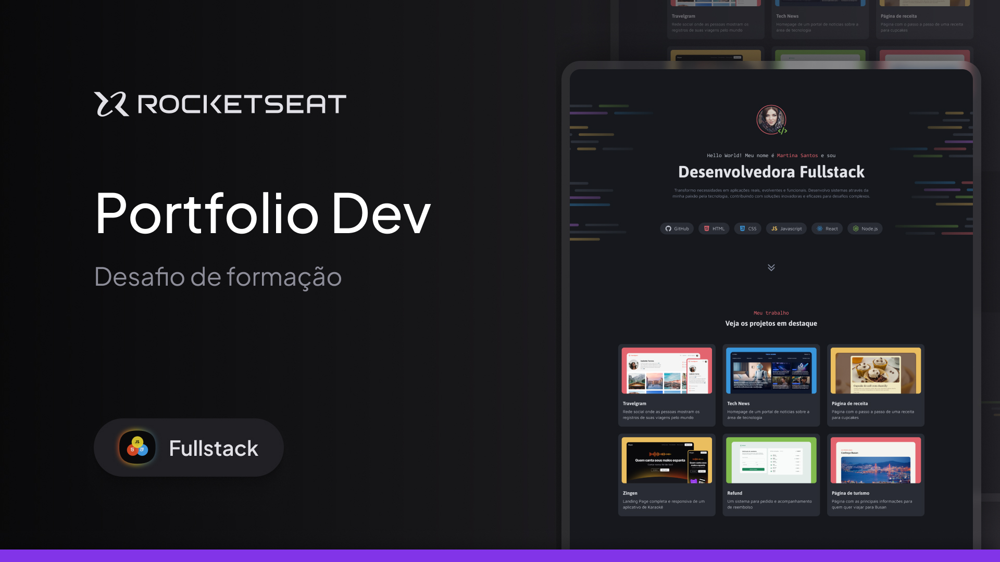

<h1 align="center"> Projeto Portfolio Dev</h1>

  <a href="#-tecnologias">Tecnologias</a>&nbsp;&nbsp;&nbsp;|&nbsp;&nbsp;&nbsp;
  <a href="#-projeto">Projeto</a>&nbsp;&nbsp;&nbsp;|&nbsp;&nbsp;&nbsp;
  <a href="#-layout">Layout</a>&nbsp;&nbsp;&nbsp;

  

## 🚀 Tecnologias

O projeto foi desenvolvido com as seguintes tecnologias:

- HTML
- CSS
- Figma

## 💻 Projeto

Esse é um dos desafios práticos da formação Fullstack. Trata-se de um site desktop de portfólio para desenvolvedores com links para projetos e contato do profissional.

A descrição do desafio pode ser visto através do [DESTE LINK](https://efficient-sloth-d85.notion.site/Desafio-pr-tico-Portf-lio-Dev-26b4dec88aaa4b5ab86618eb3d78491a), acessado pelo [Notion](https://notion.com).

## 🔖 Layout

Você pode visualizar o layout do projeto através [DESTE LINK](https://www.figma.com/community/file/1387080701963671866). É necessário ter conta no [Figma](https://figma.com) para acessá-lo.
